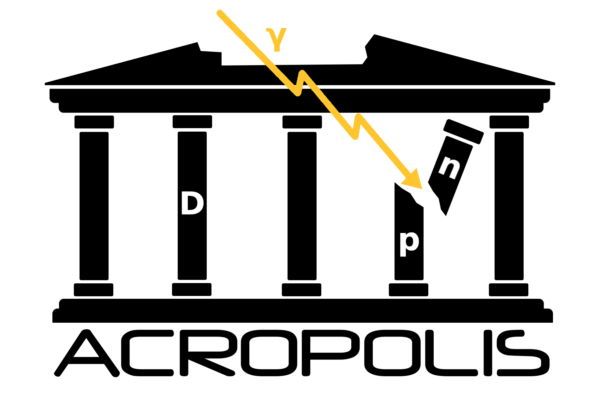

# ACROPOLIS

**A** generi**C** f**R**amework f**O**r **P**hotodisintegration **O**f **LI**ght element**S**



When using this code, please cite the following papers

- **ACROPOLIS: A generiC fRamework fOr Photodisintegration Of LIght elementS**\
  Paul Frederik Depta, Marco Hufnagel, Kai Schmidt-Hoberg\
  https://arxiv.org/abs/2011.06518
- **Updated BBN constraints on electromagnetic decays of MeV-scale particles**\
  Paul Frederik Depta, Marco Hufnagel, Kai Schmidt-Hoberg\
  https://arxiv.org/abs/2011.06519
- **BBN constraints on MeV-scale dark sectors. Part II. Electromagnetic decays**\
  Marco Hufnagel, Kai Schmidt-Hoberg, Sebastian Wild
  https://arxiv.org/abs/1808.09324

The most recent version of the manual can always be found on GitHub at manual/manual.pdf. The respective publication on arXiv might be out-of-date, especially when new versions of the code become available.

# Abstract

The remarkable agreement between observations of the primordial light element abundances and the corresponding theoretical predictions within the standard cosmological history provides a powerful method to constrain physics beyond the standard model of particle physics (BSM). For a given BSM model these primordial element abundances are generally determined by (i) Big Bang Nucleosynthesis and (ii) possible subsequent disintegration processes. The latter potentially change the abundance values due to late-time high-energy injections which may be present in these scenarios. While there are a number of public codes for the first part, no such code is currently available for the second. Here we close this gap and present ACROPOLIS, A generiC fRamework fOr Photodisintegration Of LIght elementS. The widely discussed cases of decays as well as annihilations can be run without prior coding knowledge within example programs. Furthermore, due to its modular structure, ACROPOLIS can easily be extended also to other scenarios.

# Changelog

v1.3\
(In develpment)
 - Included a new script tools/create_sm_cosmo_file.py which allows to generate the file ``cosmo_file.dat`` for sm.tar.gz and can easily be modified by the user
 - Included a new c-file tools/create_sm_abundance_file.c, which can be used with [``AlterBBN``](https://alterbbn.hepforge.org/) to
 generate the file ``abundance_file.dat`` for sm.tar.gz

v1.2.1\
(February 16, 2021)
 - Fixed a bug in ``DecayModel``. Results that have been obtained with older versions can be corrected by multiplying the parameter ``n0a`` with an additional factor ``2.7012``. All results of our papers remain unchanged.
 - Updated the set of initial abundances to the most recent values returned by [``AlterBBN``](https://alterbbn.hepforge.org/) v2.2 (explcitly, we used ``failsafe=12``)

v1.2\
(January 15, 2021)
 - Speed improvements when running non-thermal nucleosynthesis (by a factor 7)
 - Modified the directory structure by moving ./data to ./acropolis/data to transform ``ACROPOLIS`` into a proper package, which can be installed via ``python3 setup.py install --user`` (also putting the executables ``decay`` and ``annihilation`` into your ``PATH``)
 - Added the decay of neutrons and tritium to the calculation
 - For AnnihilationModel, it is now possible to freely choose the dark-matter density parameter (default is 0.12)


v1.1\
(December 1, 2020)
 - For the source terms it is now possible to specify arbitrary monochromatic and continuous contributions, meaning that the latter one is no longer limited to only final-state radiation of photons
 - By including additional JIT compilation steps, the runtime without database files was drastically increased (by approximately a factor 15)
 - The previously mentioned performance improvements also allowed to drop the large database files alltogether, which results in a better user experience (all database files are now part of the git repo and no additional download is required) and a significantly reduced RAM usage (~900MB -> ~20MB)
 - Fixed a bug, which could lead to NaNs when calculating heavily suppressed spectra with E0 >> me2/(22*T)
 - Added a unified way to print the final abundances in order to declutter the wrapper scripts. This makes it easier to focus on the actual important parts when learning how to use ``ACROPOLIS``
 - Moved from bytecode to simple text files for the remaining database file, as the former leads to unexpected behaviour on some machines
 - Added additional info and warning messages for the user's convenience

v1.0\
(November 12, 2020)
 - Initial release

# Install the dependencies

ACROPOLIS is written in Python3.7 (remember that Python2 is dead) and depends on the following packages (older versions might work, but have not been thoroughly tested)

 - NumPy (> 1.19.1)
 - SciPy (>1.5.2)
 - Numba (> 0.51.1)

The most recent versions of these packages can be collectively installed at user-level, i.e. without the need for root access, by executing the command

```
python3 -m pip install numpy, scipy, numba --user
```

If these dependencies conflict with those for other programs in your work environment, it is strongly advised to utilise the capabilities of Python's virtual environments.

# Install ACROPOLIS using pip

ACROPOLIS also comes with a ``setup.py`` file, which allows to simply install it via pip. To do this, simply run the following command in the root of the cloned repository

```
python3 -m pip install .
```

Afterwards, the different packages of ACROPOLIS can be imported into our own code, just like any other python package. The above command, also copies the executable ``decay`` and ``annihilation`` into your ``PATH`` and makes sure that all dependencies are fulfilled.

# Use the example models

Within the ACROPOLIS main directory there are two executables, ``decay`` and ``annihilation``, which wrap the scenarios discussed in section 4.1 and section 4.2 from the manual, respectively. Both of these files need to be called with six command-line arguments each, a list of which can be obtained by running the command of choice without any arguments at all. On that note, the following command runs the process of photodisintegration for an unstable mediator with a mass of 10MeV and a lifetime of 1e5s that decays exclusively into photons and has an abundance of 1e-10 relative to photons at a reference temperature of 10MeV (**if you installed ACROPOLIS using pip, you can drop the ``./`` at the beginning, since the executables are in your ``PATH``.**)

```
./decay 10 1e5 10 1e-10 0 1
```

On a similar note, the following command runs the process of photodisintegration for residual s-wave annihilations of a dark matter particle with a mass of 10MeV and a cross-section of 10e-25 cm³/s that annihialtes exclusively into photons

```
./annihilation 10 1e-25 0 0 0 1
```

# Supported platforms

ACROPOLIS has been tested on the following platforms and architectures (but lets be honest, it should run on every OS with a Python implementation)

| OS              | Version   | Arch   |
| --------------- | :-------: | :----: |
| Ubuntu          |  20.04    | x86_64 |
| KDE neon        |  5.21     | x86_64 |
| Kali GNU/Linux  |  2020.04  | x86_64 |
| macOS           |  10.15    | x86_64 |
| Windows 10      |  20H2     | x86_64 |
| Android         |  10.0     | arm64  |
